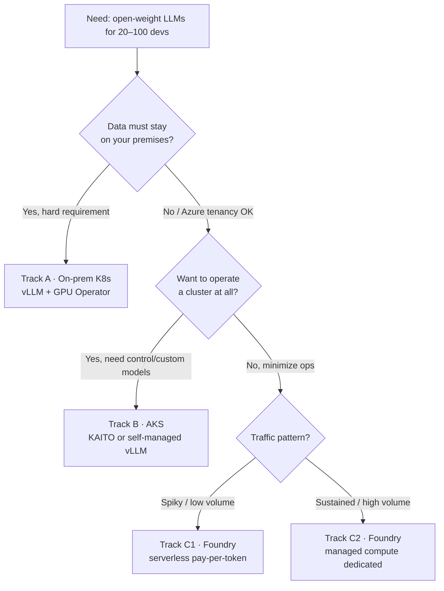

# 01 · Decision Framework — Where and How to Run Open-Weight Models

## 1. The core architectural decision

Serving LLMs to a **team** is a fundamentally different problem than running them on a laptop.
The engine choice matters more than the model choice:

| | **Ollama** | **vLLM** | **KAITO (AKS add-on)** | **Foundry managed compute** |
|---|---|---|---|---|
| Designed for | Single user, local | High-throughput multi-tenant serving | Turnkey vLLM on AKS | Zero-ops dedicated endpoint |
| Continuous batching | Basic | ✅ Best-in-class (PagedAttention) | ✅ (vLLM under the hood) | ✅ (engine managed for you) |
| Tensor parallelism (multi-GPU per model) | ❌ (layer offload only) | ✅ | ✅ | ✅ |
| Concurrent request throughput | Low — a handful of parallel decodes | 10–100× Ollama at high concurrency | Same as vLLM | SKU-dependent |
| Quantized GGUF ergonomics | ✅ Excellent | Partial (GPTQ/AWQ/FP8 preferred) | Preset images | N/A |
| OpenAI-compatible API | ✅ | ✅ | ✅ | ✅ |
| Ops burden | Trivial | You run it | AKS add-on manages lifecycle | None (PaaS) |

> **Rule of thumb:** Ollama up to ~5 concurrent users per box. Anything labelled
> "20–100 developers" needs vLLM-class continuous batching. Keep Ollama in the picture as the
> **developer-laptop tier** (offline work, experimentation) — not as the shared backend.

## 2. The three deployment tracks

## 3. Pros and cons — full matrix

### Track A · On-premises Kubernetes

**Pros**
- Absolute data sovereignty — prompts, code, and weights never leave your network. This is the
  #1 reason enterprises self-host (regulated sectors: finance, healthcare, defense).
- Lowest marginal cost at sustained high utilization — a purchased GPU amortized over 3 years
  beats cloud rates when utilization > ~50–60%.
- Full stack control: kernel, drivers, CUDA version, engine version, custom/fine-tuned models,
  no vendor deprecation timelines.
- Latency: single-digit-ms network hop for on-site devs.

**Cons**
- CapEx: an 8× H100 server is ~USD 250–400K; even 4× L40S nodes are ~USD 50–70K each. Lead
  times of weeks–months.
- You own everything: driver/firmware matrix, GPU failures (a dead HBM stack is an RMA, not a
  ticket), power/cooling (a DGX-class node draws ~10 kW), on-call.
- Capacity is a step function — you can't burst for a hackathon week.
- Talent: needs at least one engineer comfortable with NVIDIA GPU Operator, NCCL, and K8s
  device plugins.

### Track B · AKS (KAITO add-on or self-managed vLLM)

**Pros**
- Elastic: scale GPU node pools to zero nights/weekends, burst for load spikes; spot pools for
  60–90% VM discounts on interruptible capacity.
- KAITO (CNCF sandbox, AKS managed add-on) automates GPU node provisioning + preset model
  deployment down to a single CRD; upgrades handled by the add-on.
- Azure-native security: Entra ID, Private Link, Azure Policy, Defender for Containers,
  Azure Monitor — no bespoke bolt-ons.
- Data stays inside your subscription/VNet (satisfies most "no third-party API" policies even
  though it's cloud).

**Cons**
- GPU VM pricing is significant at steady state: a single NC24ads A100 v4 (1× A100 80GB) is
  roughly USD 3.5–4.7/hr pay-as-you-go (~USD 2.5–3.4K/month per GPU, region-dependent —
  verify current pricing). Reservations/Savings Plans cut 30–60%.
- GPU quota: you must request vCPU quota per GPU family per region; popular SKUs
  (A100/H100) can be constrained.
- Still Kubernetes: you own workload-level ops (KAITO reduces but doesn't eliminate this).
- KAITO add-on limitations: no Windows node pools, no AMD GPU instanceTypes, public regions only.

### Track C · Azure AI Foundry

Two sub-modes (Foundry model catalog):

**C1 — Serverless API / standard deployment (pay-per-token)** — available for flagship open
models sold through Azure (Llama, DeepSeek R1, Mistral, gpt-oss, Grok, etc.)

- ✅ Zero infrastructure. Per-token billing. Content filtering built in. Fastest time-to-first-request (minutes).
- ✅ Great for spiky/low-volume usage and for the *reasoning escalation tier* while your main traffic runs on Track A/B.
- ❌ Per-token cost scales linearly with usage forever — at 100-dev agentic volume this usually exceeds dedicated compute.
- ❌ Model list limited to what Azure sells serverless; no custom fine-tunes on this mode; regional availability varies.

**C2 — Managed compute (dedicated)** — deploy *any* catalog/HF/custom model onto dedicated
GPU VMs that Azure operates, billed per compute-hour.

- ✅ Any open/custom model incl. Hugging Face collection & NVIDIA NIMs; endpoint + autoscale managed; no cluster.
- ✅ Private networking supported; billed per uptime minute, delete = stop paying.
- ❌ You pay for the VM whether busy or idle (same economics as Track B without the cluster flexibility).
- ❌ Less engine-level tuning surface than running vLLM yourself (batching knobs, prefix cache, spec decode configs).
- ❌ No content filtering on managed compute (unlike standard/serverless) — bring your own guardrails.

### Summary decision table

| Criterion | A · On-prem | B · AKS | C1 · Serverless | C2 · Managed compute |
|---|---|---|---|---|
| Data residency guarantees | ★★★★★ | ★★★★ | ★★★ | ★★★★ |
| Ops burden | ★ (highest) | ★★★ | ★★★★★ | ★★★★ |
| Cost @ high sustained load | ★★★★★ | ★★★ | ★ | ★★★ |
| Cost @ spiky/low load | ★ | ★★★★ | ★★★★★ | ★★ |
| Elasticity / burst | ★ | ★★★★★ | ★★★★★ | ★★★ |
| Custom / fine-tuned models | ★★★★★ | ★★★★★ | ★ | ★★★★ |
| Engine-level perf tuning | ★★★★★ | ★★★★★ | ★ | ★★ |
| Time to first token in prod | weeks | days | minutes | hours |

## 4. Recommended patterns by team size

| Team | Recommended architecture |
|---|---|
| **20 devs** | Single track. Either: 1 on-prem node (2–4× L40S or 1× H100) with vLLM; or AKS with 1× NC-series node + KAITO; or pure Foundry serverless if usage is light. |
| **50 devs** | Track A or B with 2–4 GPUs, 2 model tiers (coder default + small fast), LiteLLM gateway mandatory, HPA on queue depth. Foundry serverless as the frontier-reasoning escape hatch. |
| **100 devs** | Track B (or A with a real platform team): 4–8 GPUs across 2+ nodes, 3 model tiers, autoscaling + spot burst pool, full observability stack, per-team budgets, canary model rollouts. Hybrid: sustained base on dedicated GPUs + Foundry serverless overflow. |

**The hybrid pattern (most common at 50+):** dedicated GPUs (Track A/B) serve the default
coder model at high utilization; the gateway routes frontier-reasoning requests (a few % of
traffic) to Foundry serverless DeepSeek-R1/Kimi-K2 pay-per-token. Best of both cost curves.

## 5. What NOT to do

1. **Don't deploy Ollama as the shared backend for 20+ devs.** Its scheduler is not built for
   high-concurrency batching; you'll conclude "local models are slow" when the engine was the problem.
2. **Don't buy GPUs before measuring.** Run a 2-week pilot on cloud GPUs, capture real
   requests/dev/day and token distributions, then size hardware (see [02-capacity-planning.md](02-capacity-planning.md)).
3. **Don't expose raw model endpoints to devs.** Always front with a gateway (auth, quotas,
   routing, observability). See [06-gateway-and-devex.md](06-gateway-and-devex.md).
4. **Don't run one giant model for everything.** A 3-tier catalog (fast / default coder /
   reasoning) cuts cost 3–5× vs. routing all traffic to the biggest model.
5. **Don't skip license review.** Apache-2.0/MIT models (Qwen, DeepSeek, Mistral, gpt-oss) are
   safe defaults; Llama and Gemma carry custom terms needing legal sign-off ([09-security-governance.md](09-security-governance.md)).
