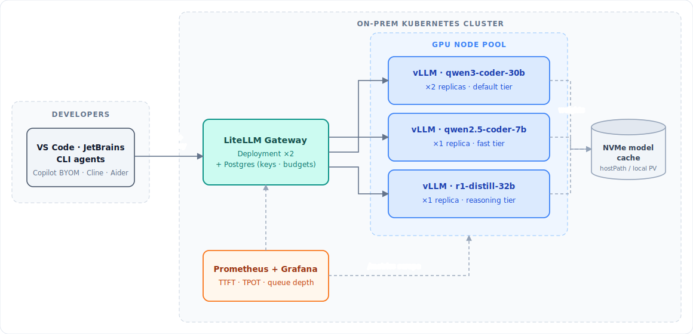

# 03 · Track A — On-Premises Kubernetes Implementation

Full implementation: bare GPUs → production vLLM serving platform. Assumes K8s ≥ 1.29
(kubeadm, RKE2, OpenShift, or Talos) and NVIDIA data-center GPUs (L40S / A100 / H100).

## 1. Architecture



## 2. Node preparation

Per GPU node:

- **OS**: Ubuntu 22.04/24.04 LTS (widest NVIDIA support). Disable nouveau.
- **NVMe**: ≥ 2 TB local NVMe for model weights (`/var/lib/models`) — weights load 5–10× faster
  from local NVMe than NFS.
- **BIOS**: enable SR-IOV/above-4G decoding; for multi-GPU nodes verify NVLink topology with
  `nvidia-smi topo -m` after install.
- Do **not** install CUDA drivers manually — the GPU Operator manages them.

## 3. NVIDIA GPU Operator

The GPU Operator installs drivers, container toolkit, device plugin, DCGM metrics, and MIG
manager as K8s workloads:

```bash
helm repo add nvidia https://helm.ngc.nvidia.com/nvidia && helm repo update

helm install gpu-operator nvidia/gpu-operator \
  -n gpu-operator --create-namespace \
  --set driver.enabled=true \
  --set dcgmExporter.enabled=true \
  --set migManager.enabled=true

# Verify: all pods Running, then
kubectl get nodes -o json | jq '.items[].status.allocatable["nvidia.com/gpu"]'
```

Label and taint GPU nodes so only inference workloads land there:

```bash
kubectl label node gpu-node-1 workload=llm-inference gpu.type=h100-80gb
kubectl taint node gpu-node-1 nvidia.com/gpu=present:NoSchedule
```

**GPU sharing options** (for the fast tier on big GPUs):
- **MIG** (A100/H100): hardware-partition one 80GB GPU into e.g. 2× 40GB or 4× 20GB slices with
  full isolation — ideal for co-hosting the 7B fast model.
- **Time-slicing**: software sharing, no memory isolation — acceptable only for dev/test.

## 4. Model weight management

Pre-download weights to local NVMe via a DaemonSet/Job rather than letting vLLM pull from
Hugging Face on every pod start:

```yaml
# model-downloader-job.yaml (one per model, or a loop script)
apiVersion: batch/v1
kind: Job
metadata: { name: dl-qwen3-coder-30b, namespace: llm }
spec:
  template:
    spec:
      nodeSelector: { workload: llm-inference }
      tolerations: [{ key: nvidia.com/gpu, operator: Exists }]
      restartPolicy: OnFailure
      containers:
      - name: dl
        image: python:3.12-slim
        command: ["bash","-c"]
        args:
          - pip install -q "huggingface_hub[hf_transfer]" &&
            HF_HUB_ENABLE_HF_TRANSFER=1 hf download
            Qwen/Qwen3-Coder-30B-A3B-Instruct-FP8
            --local-dir /models/qwen3-coder-30b-fp8
        env:
          - name: HF_TOKEN
            valueFrom: { secretKeyRef: { name: hf-token, key: token } }
        volumeMounts: [{ name: models, mountPath: /models }]
      volumes:
        - name: models
          hostPath: { path: /var/lib/models, type: DirectoryOrCreate }
```

For air-gapped environments: mirror weights to an internal OCI registry (ORAS) or an internal
S3 (MinIO), and set `HF_HUB_OFFLINE=1` on serving pods.

## 5. vLLM serving deployments

### Default tier — Qwen3-Coder-30B-A3B (FP8), 1 GPU per replica

```yaml
apiVersion: apps/v1
kind: Deployment
metadata: { name: vllm-qwen3-coder-30b, namespace: llm }
spec:
  replicas: 2
  selector: { matchLabels: { app: vllm-qwen3-coder-30b } }
  strategy: { type: RollingUpdate, rollingUpdate: { maxSurge: 1, maxUnavailable: 0 } }
  template:
    metadata:
      labels: { app: vllm-qwen3-coder-30b }
      annotations:
        prometheus.io/scrape: "true"
        prometheus.io/port: "8000"
        prometheus.io/path: "/metrics"
    spec:
      nodeSelector: { workload: llm-inference }
      tolerations: [{ key: nvidia.com/gpu, operator: Exists }]
      containers:
      - name: vllm
        image: vllm/vllm-openai:latest   # pin a tested tag in prod
        args:
          - --model=/models/qwen3-coder-30b-fp8
          - --served-model-name=qwen3-coder-30b
          - --max-model-len=65536          # cap context; KV budget, see doc 02 §3
          - --max-num-seqs=32
          - --gpu-memory-utilization=0.92
          - --enable-prefix-caching        # big win for agents re-sending context
          - --enable-chunked-prefill       # protects TPOT from long-prompt stalls
          - --enable-auto-tool-choice
          - --tool-call-parser=qwen3_coder # check parser name for your vLLM version
        ports: [{ containerPort: 8000 }]
        resources:
          limits: { nvidia.com/gpu: "1", memory: 96Gi, cpu: "12" }
          requests: { nvidia.com/gpu: "1", memory: 64Gi, cpu: "8" }
        volumeMounts:
          - { name: models, mountPath: /models, readOnly: true }
          - { name: shm, mountPath: /dev/shm }
        startupProbe:                       # model load can take minutes
          httpGet: { path: /health, port: 8000 }
          failureThreshold: 60
          periodSeconds: 10
        readinessProbe:
          httpGet: { path: /health, port: 8000 }
          periodSeconds: 5
        livenessProbe:
          httpGet: { path: /health, port: 8000 }
          periodSeconds: 15
          failureThreshold: 3
      volumes:
        - name: models
          hostPath: { path: /var/lib/models }
        - name: shm
          emptyDir: { medium: Memory, sizeLimit: 16Gi }
---
apiVersion: v1
kind: Service
metadata: { name: vllm-qwen3-coder-30b, namespace: llm }
spec:
  selector: { app: vllm-qwen3-coder-30b }
  ports: [{ port: 8000, targetPort: 8000 }]
```

### Fast tier — Qwen2.5-Coder-7B on a MIG slice

Same manifest, with:

```yaml
args:
  - --model=/models/qwen2.5-coder-7b-awq
  - --served-model-name=qwen2.5-coder-7b
  - --max-model-len=32768
  - --max-num-seqs=64
resources:
  limits: { nvidia.com/mig-3g.40gb: "1" }   # MIG profile instead of full GPU
```

### Reasoning tier — multi-GPU with tensor parallelism (e.g. gpt-oss-120B on 2 GPUs)

```yaml
args:
  - --model=/models/gpt-oss-120b
  - --served-model-name=gpt-oss-120b
  - --tensor-parallel-size=2          # must be on NVLink-connected GPUs
  - --max-model-len=131072
resources:
  limits: { nvidia.com/gpu: "2" }
```

> TP > 1 across PCIe-only GPUs works but loses 20–40% throughput vs NVLink. Never split TP
> across nodes for these model sizes; pipeline/multi-node parallelism is a >70B-dense concern.

### Ollama alternative (only for ≤ ~20 light users)

If the team insists on Ollama for its GGUF/registry ergonomics, deploy it as a StatefulSet with
`OLLAMA_NUM_PARALLEL=8`, `OLLAMA_KEEP_ALIVE=-1`, `OLLAMA_CONTEXT_LENGTH=32768`, and a PVC at
`/root/.ollama`. Expect materially lower concurrent throughput than vLLM on identical hardware;
plan to migrate the shared tier to vLLM as usage grows. Keep Ollama as the *laptop* tier regardless.

## 6. Autoscaling on queue depth

Scale on vLLM's `vllm:num_requests_waiting` (queued requests), not CPU:

```yaml
# Requires prometheus-adapter exposing vllm metrics as external/custom metrics
apiVersion: autoscaling/v2
kind: HorizontalPodAutoscaler
metadata: { name: vllm-qwen3-coder-30b, namespace: llm }
spec:
  scaleTargetRef: { apiVersion: apps/v1, kind: Deployment, name: vllm-qwen3-coder-30b }
  minReplicas: 2
  maxReplicas: 4          # bounded by physical GPUs on-prem
  metrics:
    - type: Pods
      pods:
        metric: { name: vllm_num_requests_waiting }
        target: { type: AverageValue, averageValue: "4" }
  behavior:
    scaleUp:   { stabilizationWindowSeconds: 60 }
    scaleDown: { stabilizationWindowSeconds: 600 }   # model load is expensive; scale down slowly
```

On-prem, HPA is bounded by owned GPUs — its real job is **bin-packing tiers**: e.g. evict the
reasoning replica during 9–11 am peak to run a third default replica (use priorityClasses).

## 7. Networking & ingress

- Expose **only the gateway** ([06-gateway-and-devex.md](06-gateway-and-devex.md)) via ingress
  (nginx/Traefik) with TLS from your internal CA. vLLM services stay ClusterIP.
- NetworkPolicy: deny-all in `llm` namespace; allow gateway → vLLM :8000 and Prometheus → :8000 `/metrics`.
- Set ingress/gateway timeouts ≥ 600 s (agent requests stream for minutes) and disable response
  buffering for SSE streaming.

## 8. On-prem-specific runbook items

| Failure | Detection | Action |
|---|---|---|
| GPU ECC errors / falls off bus | DCGM exporter `DCGM_FI_DEV_XID_ERRORS` | Cordon node, drain LLM pods, RMA |
| Thermal throttling | DCGM `DCGM_FI_DEV_GPU_TEMP` > 85 °C | Check airflow/inlet temps; cap clocks with `nvidia-smi -lgc` |
| NVMe full (model hoarding) | node-exporter fs usage | Retention policy: keep current + previous model version only |
| Driver/CUDA upgrade | planned | GPU Operator supports rolling driver upgrades; do one node at a time with pod disruption budgets |

Continue to: [06-gateway-and-devex.md](06-gateway-and-devex.md) · [07-performance.md](07-performance.md) · [08-operations.md](08-operations.md)
