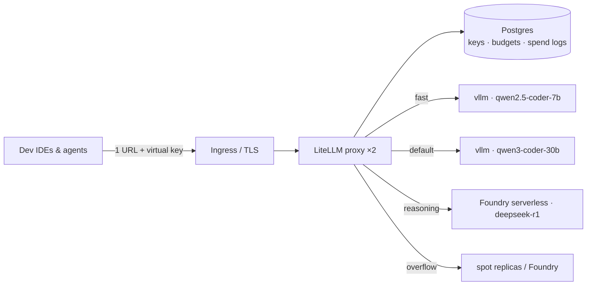

# 06 · Gateway & Developer Experience (All Tracks)

The gateway is the **single most important component** for multi-team scale: one
OpenAI-compatible URL, per-team keys and budgets, model routing, failover, and the usage data
that drives capacity planning. Reference implementation: **LiteLLM Proxy** (OSS, battle-tested);
alternatives: Envoy AI Gateway, Kong AI Gateway, Azure API Management (as an AI Gateway in
front of Foundry endpoints — see the `azure-aigateway` patterns).

## 1. Architecture



## 2. LiteLLM deployment (K8s, works on Track A and B)

```yaml
apiVersion: apps/v1
kind: Deployment
metadata: { name: litellm, namespace: llm }
spec:
  replicas: 2
  selector: { matchLabels: { app: litellm } }
  template:
    metadata: { labels: { app: litellm } }
    spec:
      containers:
      - name: litellm
        image: ghcr.io/berriai/litellm:main-stable   # pin a tag
        args: ["--config", "/etc/litellm/config.yaml", "--port", "4000"]
        ports: [{ containerPort: 4000 }]
        env:
          - { name: DATABASE_URL, valueFrom: { secretKeyRef: { name: litellm-secrets, key: database-url } } }
          - { name: LITELLM_MASTER_KEY, valueFrom: { secretKeyRef: { name: litellm-secrets, key: master-key } } }
          - { name: AZURE_AI_API_KEY, valueFrom: { secretKeyRef: { name: litellm-secrets, key: foundry-key } } }
        volumeMounts: [{ name: cfg, mountPath: /etc/litellm }]
        resources: { requests: { cpu: "1", memory: 2Gi }, limits: { cpu: "4", memory: 4Gi } }
      volumes: [{ name: cfg, configMap: { name: litellm-config } }]
```

## 3. The routing config — model tiers, fallbacks, budgets

```yaml
# configmap: litellm-config
model_list:
  # ---- fast tier ----
  - model_name: fast
    litellm_params:
      model: openai/qwen2.5-coder-7b
      api_base: http://vllm-qwen25-coder-7b.llm.svc:8000/v1
      api_key: "none"

  # ---- default tier (load-balanced across replicas incl. spot) ----
  - model_name: default
    litellm_params:
      model: openai/qwen3-coder-30b
      api_base: http://vllm-qwen3-coder-30b.llm.svc:8000/v1
      api_key: "none"

  # ---- reasoning tier on Foundry serverless ----
  - model_name: reasoning
    litellm_params:
      model: azure_ai/deepseek-r1
      api_base: https://llm-foundry.services.ai.azure.com
      api_key: os.environ/AZURE_AI_API_KEY

router_settings:
  routing_strategy: least-busy
  num_retries: 2
  timeout: 600
  fallbacks:
    - { default: ["reasoning"] }     # overflow: default queue saturated → Foundry
    - { fast: ["default"] }

litellm_settings:
  drop_params: true                  # tolerate client params engines don't support
  success_callback: ["prometheus"]   # /metrics for scrape

general_settings:
  master_key: os.environ/LITELLM_MASTER_KEY
  database_url: os.environ/DATABASE_URL
```

### Per-team virtual keys and budgets

```bash
# Team key: 5M tokens/day budget, access to fast+default only
curl -s http://litellm.llm.svc:4000/key/generate \
  -H "Authorization: Bearer $MASTER_KEY" -H "Content-Type: application/json" \
  -d '{
    "team_id": "payments-squad",
    "models": ["fast", "default"],
    "max_budget": 50, "budget_duration": "1d",
    "rpm_limit": 300, "tpm_limit": 500000
  }'
```

Governance defaults that mirror the "use Auto, then promote" principle:
- Every team gets `fast` + `default`.
- `reasoning` is allow-listed per team (it's the expensive tier — Foundry per-token or big GPUs).
- Per-user rate limits prevent one runaway agent loop from starving the team.
- Spend logs → the capacity-planning SQL in [02-capacity-planning.md](02-capacity-planning.md) §6.

## 4. IDE and agent integration

One base URL for everything: `https://llm.internal.example.com/v1`.

**VS Code — GitHub Copilot BYO model**: Copilot Chat supports OpenAI-compatible/Ollama-style
local providers (Manage Models → provider → custom endpoint). Point it at the gateway URL with
the team key; expose `default` and `reasoning` as selectable models.

**Cline / Roo / Continue / Aider** (agentic OSS tooling):

```jsonc
// Continue example (~/.continue/config.json)
{
  "models": [{
    "title": "default (qwen3-coder-30b)",
    "provider": "openai",
    "apiBase": "https://llm.internal.example.com/v1",
    "apiKey": "<team-virtual-key>",
    "model": "default"
  }]
}
```

```bash
# Aider
export OPENAI_API_BASE=https://llm.internal.example.com/v1
export OPENAI_API_KEY=<team-key>
aider --model openai/default
```

**Tab-completion (FIM)**: point completion plugins at the `fast` tier; vLLM serves
`/v1/completions` with FIM tokens for Qwen2.5-Coder. Keep completions OFF the default tier —
they're latency-critical and high-QPS.

**Laptop tier**: devs who work offline run `ollama run qwen3-coder:30b` locally (per the
[model picker](../oss-model-picker.html)); the gateway remains the shared source of truth for
team workloads.

## 5. Operational features to enable from day one

| Feature | Why |
|---|---|
| Prometheus callback + `/metrics` | Requests, tokens, latency per model/team — feeds dashboards & alerts |
| Spend logs in Postgres | Chargeback/showback per team; pilot data for sizing |
| Retry + fallback chains | Node eviction (spot) and rollouts become invisible to devs |
| Request/response logging OFF by default | Prompts contain proprietary code — log metadata only ([09-security-governance.md](09-security-governance.md)) |
| Model aliasing (`default`, `fast`, `reasoning`) | Swap underlying models without touching a single IDE config |

That last row is the quiet superpower: upgrading `default` from Qwen3-Coder-30B to next year's
model is a gateway config change and a canary, not a 100-dev migration.
